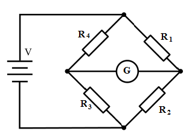
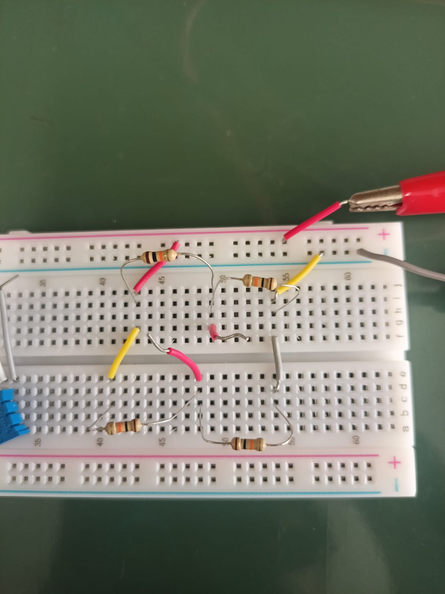
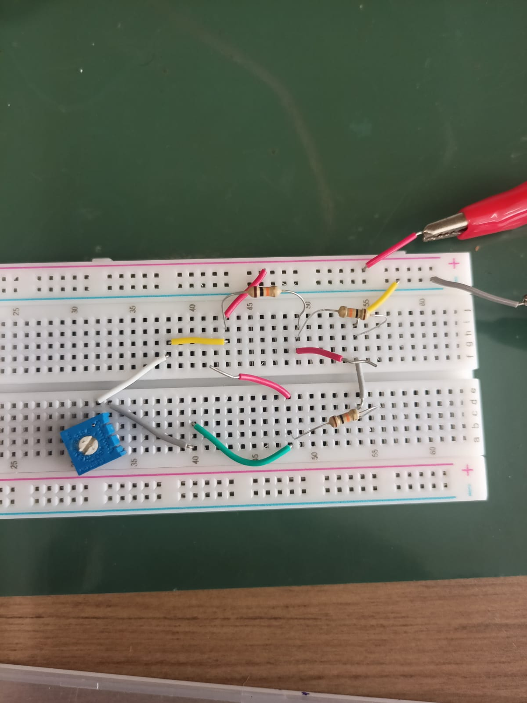

# **Realização de testes em bancada utilizando a montagem do cicuito da Ponte de Wheatstone, a fim de simular uma célula de carga (sensor de Peso)**

## **Materiais utilizados**

- Resistores de 1K Ohm e 10k Ohm;

- Jumpers;

- Protoboard;

- Potenciômetro Trimpot de 1K Ohm e 10K Ohm;

- Multímetro;

## **Esquemático conceitual da Ponte de Wheatstone**

## **Montagem real do circuito utilizando resistores fixos**

## **Montagem real do circuito 1/4 de ponte utilizando Trimpot como resistor variável**

## **Registros da verificação da DDP gerada pelo circuito com 1/4 de ponte de Wheatstone em equilíbrio (Vídeo)**

